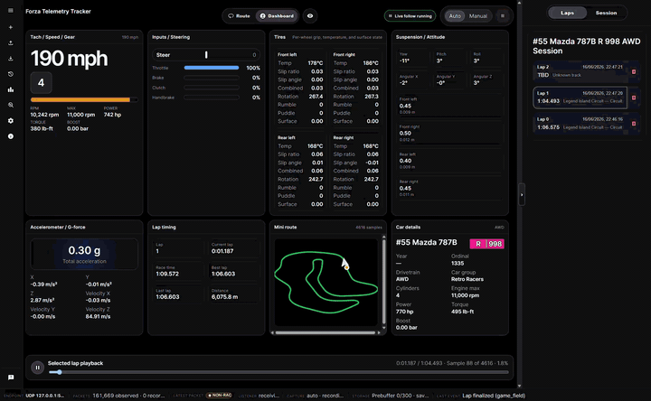

# Forza Telemetry Tracker

[Support development on Ko-fi](https://ko-fi.com/Z4I021C66X)

Windows desktop telemetry companion for Forza Horizon 6 Data Out. It records local UDP telemetry, stores sessions in SQLite, shows live and review dashboards, supports route and map visualisation from locally owned game files, and can check public GitHub Releases for manual updates.

Forza is a trademark of Microsoft. This project is an unofficial community tool and is not affiliated with, endorsed by, or sponsored by Microsoft, Xbox Game Studios, Turn 10 Studios, Playground Games, or the Forza franchise owners.

## Preview




## User install flow

The intended user experience is a single Windows setup executable downloaded from [GitHub Releases](https://github.com/seevydeepy/forza-telemetry-tracker/releases). Users do not need Python, Node.js, .NET, PowerShell scripts, or command-line setup.

1. Download `ForzaTelemetryTrackerSetup-vX.Y.Z-x64.exe` from the latest release.
2. Run the installer. The current builds are unsigned, so Windows SmartScreen may show a warning.
3. In Forza Horizon 6, enable Data Out and set the destination to IP `127.0.0.1` and port `5400`.
4. Launch Forza Telemetry Tracker from the Start Menu or desktop shortcut.

The app is designed for same-PC Data Out capture. It does not forward telemetry to a cloud service unless you explicitly choose to send an in-app feedback report.

## Data and privacy

- Telemetry sessions are stored locally under `%LOCALAPPDATA%\Forza Telemetry Tracker`.
- The main session database is `telemetry_tracker.sqlite3`.
- Optional world-map cache files are generated locally under `%LOCALAPPDATA%\Forza Telemetry Tracker\map-cache` from a valid local game install folder that you choose.
- No game files or generated map cache files are committed to this repository or bundled in releases.
- There is no automatic analytics, crash reporting, or telemetry upload path.
- The `Send Feedback` window is user-initiated. It can send your written report to a private maintainer triage repository through a Cloudflare Worker without requiring a GitHub account.
- If feedback cannot be sent immediately, the app may save the report locally and retry later. Reports are capped and expired from the local retry outbox.
- The optional diagnostics checkbox defaults off. When enabled, diagnostics are sanitized and limited to app metadata, platform details, listener/capture status, local database/log sizes, row counts, and recent app log lines. It does not include raw telemetry packets, session databases, map cache files, game files, screenshots, exports, or personal files.
- The About window performs a user-initiated network request to public GitHub Releases only when you click `Check for updates`.
- The Ko-fi support link opens a browser only when clicked.

## Developer workflow

```powershell
python -m pip install -r requirements-telemetry-tracker.txt
python -m pip install -r requirements-telemetry-test.txt
npm --prefix web\telemetry-tracker ci
python tools\run-telemetry-tracker.py
```

For deterministic Windows release builds, maintainers use the generated Python lock file:

```powershell
uv pip compile requirements-telemetry-desktop.txt requirements-telemetry-test.txt --python-version 3.12 --python-platform windows --generate-hashes -o requirements-telemetry-release-lock.txt
python -m pip install -r requirements-telemetry-release-lock.txt
```

Frontend release and CI installs use `npm ci` against `web/telemetry-tracker/package-lock.json`.

## Contributing and support

- Start with [CONTRIBUTING.md](CONTRIBUTING.md) for local setup, tests, and pull request expectations.
- Use [SUPPORT.md](SUPPORT.md) for help and troubleshooting routes.
- Review [PRIVACY.md](PRIVACY.md) for local data and network behavior.
- Report security issues privately using [SECURITY.md](SECURITY.md).
- Be direct and respectful under [CODE_OF_CONDUCT.md](CODE_OF_CONDUCT.md).

## License

MIT License. Third-party notices and bundled licenses are in `THIRD_PARTY_NOTICES.md` and `licenses/`.
