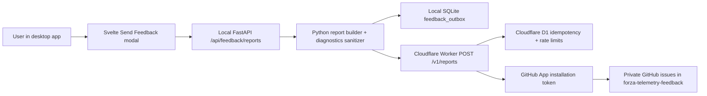

# Forza Telemetry Tracker Anonymous Feedback Pipeline Design Handoff

## Goal

Add a Mood-Swings-style anonymous in-app feedback/reporting system to `forza-telemetry-tracker`:

- User opens a **Send Feedback** modal from the Svelte UI.
- User selects category, enters description, optionally includes diagnostics.
- App shows a **progress toast**, then completes it as success, queued, or failed.
- The local Python backend builds and sanitizes a report.
- A Cloudflare Worker receives the report and creates a GitHub issue in a new private `seevydeepy/forza-telemetry-feedback` triage repo via a GitHub App.
- No player GitHub login, no client-side GitHub credentials, no raw telemetry/session DB upload.

## Recommended architecture



Use a **dedicated Worker + dedicated D1 database** for Forza, not the Mood Swings Worker/D1. Suggested names:

- Worker: `forza-telemetry-feedback`
- D1 DB: `forza-telemetry-feedback`
- Private GitHub triage repo: `seevydeepy/forza-telemetry-feedback`
- Default URL: `https://forza-telemetry-feedback.<cloudflare-subdomain>.workers.dev`
- Endpoint: `/v1/reports`

The main `seevydeepy/forza-telemetry-tracker` repository is public and should remain public. Do not create user feedback issues there, and do not rely on per-issue privacy inside a public GitHub repository. GitHub issue visibility follows repository visibility, so feedback reports belong in the separate private triage repo.

No custom `cvdp.net` route is required for v1.

## Key repo entry points to inspect

Current repo shape observed:

- Backend: `F:\code\git\forza-telemetry-tracker\telemetry_tracker\app.py`
- Diagnostics helper: `F:\code\git\forza-telemetry-tracker\telemetry_tracker\diagnostics.py`
- App paths/log folders: `F:\code\git\forza-telemetry-tracker\telemetry_tracker\app_paths.py`
- Desktop logging: `F:\code\git\forza-telemetry-tracker\telemetry_tracker\desktop_launcher.py`
- Frontend API wrapper: `F:\code\git\forza-telemetry-tracker\web\telemetry-tracker\src\api.ts`
- Frontend root/toast/modal/menu wiring: `F:\code\git\forza-telemetry-tracker\web\telemetry-tracker\src\App.svelte`
- Existing modal shell: `F:\code\git\forza-telemetry-tracker\web\telemetry-tracker\src\AppModal.svelte`
- Existing toast UI: `F:\code\git\forza-telemetry-tracker\web\telemetry-tracker\src\ToastStack.svelte`
- Existing menu: `F:\code\git\forza-telemetry-tracker\web\telemetry-tracker\src\SlideOutMenu.svelte`

Mood Swings reference to port from:

- `F:\code\git\thegame\tools\feedback_worker`
- `F:\code\git\thegame\docs\feedback_reporting_setup.md`

## Cloud backend design

Port the Mood Swings Worker scaffold, but rename and specialize it.

Create in Forza repo:

- `F:\code\git\forza-telemetry-tracker\tools\feedback_worker\package.json`
- `F:\code\git\forza-telemetry-tracker\tools\feedback_worker\wrangler.toml`
- `F:\code\git\forza-telemetry-tracker\tools\feedback_worker\src\index.ts`
- `F:\code\git\forza-telemetry-tracker\tools\feedback_worker\src\schema.ts`
- `F:\code\git\forza-telemetry-tracker\tools\feedback_worker\src\githubApp.ts`
- `F:\code\git\forza-telemetry-tracker\tools\feedback_worker\src\rateLimit.ts`
- `F:\code\git\forza-telemetry-tracker\tools\feedback_worker\migrations\0001_feedback_state.sql`
- Worker tests under `tools\feedback_worker\test`

Worker responsibilities:

1. `GET /health`
2. `POST /v1/reports`
3. Validate JSON schema.
4. Enforce max body size.
5. HMAC-hash `reporter_id` and request IP using `REPORT_HMAC_SECRET`.
6. D1 stores:
   - report idempotency by `report_ref`
   - status: `creating`, `created`, `failed`
   - GitHub issue number/url
   - fixed-window rate limit counters
7. Generate GitHub App JWT.
8. Exchange JWT for installation access token.
9. Search private feedback repo issues for the report ref.
10. Create issue if none exists.
11. Return `{ ok, report_ref, issue_number, issue_url }`.

The user's raw public IP is only a transient Worker input for rate limiting and anti-abuse. The Worker must not write raw IPs to GitHub issues, GitHub comments, D1 rows, durable logs, or returned API responses. Store and compare only HMAC-derived rate-limit keys.

Suggested Forza report ref format:

```text
FTT-[A-Z2-7]{8}
```

Use a longer random suffix than Mood Swings to reduce collision concerns.

Suggested categories:

- `Bug`
- `Data Out setup`
- `Telemetry recording`
- `Map or route visualisation`
- `Import or export`
- `Performance`
- `UI or UX`
- `Other`

Suggested GitHub labels, only if labels already exist:

- `type:bug`
- `area:data-out`
- `area:capture`
- `area:map-route`
- `area:import-export`
- `area:performance`
- `area:ui`
- `type:feedback`

If labels are missing, Worker should retry issue creation without labels, as Mood Swings does.

## GitHub App setup

Create a new **private** GitHub repository first:

- Repository: `seevydeepy/forza-telemetry-feedback`
- Purpose: private feedback triage and issue storage for the public tracker app
- Visibility: private
- Contents: minimal README explaining that issues are generated by the feedback Worker

Use a **dedicated GitHub App** if possible:

- Name: `Forza Telemetry Feedback`
- Install only on `seevydeepy/forza-telemetry-feedback`
- Repository permissions:
  - Metadata: read-only
  - Issues: read/write

The game user never authenticates with GitHub. The Worker authenticates as the installed GitHub App.

Cloudflare Worker secrets:

- `GITHUB_APP_ID`
- `GITHUB_INSTALLATION_ID`
- `GITHUB_PRIVATE_KEY_PEM`
- `REPORT_HMAC_SECRET`

Cloudflare non-secret vars:

- `GITHUB_OWNER = "seevydeepy"`
- `GITHUB_REPO = "forza-telemetry-feedback"`
- `MAX_BODY_BYTES = "65536"`
- `REPORTER_LIMIT_PER_HOUR = "5"`
- `IP_LIMIT_PER_HOUR = "20"`

## Local backend design

Add a Python module:

- `F:\code\git\forza-telemetry-tracker\telemetry_tracker\feedback.py`

Recommended backend API:

- `GET /api/feedback/config`
  - returns enabled state, categories, max description length, diagnostics description
- `POST /api/feedback/reports`
  - accepts UI input
  - builds report
  - submits or queues
- Optional: `POST /api/feedback/retry-pending`
  - for explicit retry or startup retry

Frontend should only talk to local FastAPI. Do **not** have the Svelte UI call Cloudflare directly. This avoids CORS and keeps diagnostics collection in Python.

Use `httpx`, already in `requirements-telemetry-tracker.txt`.

## Local queue decision

Use **SQLite**, not JSON files.

Add a feedback outbox table either in the existing app database through `TelemetryStore`, or a small separate SQLite DB under app data. Prefer existing DB if repo conventions make migrations easy.

Table shape:

```sql
CREATE TABLE IF NOT EXISTS feedback_outbox (
  report_ref TEXT PRIMARY KEY,
  payload_json TEXT NOT NULL,
  status TEXT NOT NULL DEFAULT 'pending',
  attempt_count INTEGER NOT NULL DEFAULT 0,
  last_error TEXT,
  created_at_ms INTEGER NOT NULL,
  updated_at_ms INTEGER NOT NULL,
  next_attempt_at_ms INTEGER NOT NULL
);
```

Queue rules:

- Max pending rows: 25
- Max attempts per report: 10
- Expire/drop unsent reports after 30 days
- Retry only reports the user already attempted to send
- On retryable errors, return “queued” to UI
- On validation/privacy errors, do not queue

## Diagnostics and privacy

This repo currently advertises a local-first/no-upload model, so privacy docs must ship **in the same commit/release** as the feature.

Diagnostics toggle should default **on** for this app so diagnostics are opt-out. The modal body should not include the full diagnostics disclosure; show this copy as a tooltip on hover/focus over the Include diagnostics control:

> Diagnostics may include app version, platform, listener/capture status, local database/log sizes, row counts, and recent sanitized app log lines. They do not include raw telemetry packets, session databases, map cache files, game files, screenshots, exports, or personal data of any kind.

Allowed diagnostics:

- app version/channel/git sha from app metadata
- OS/platform/Python/package mode
- current view/source tag
- listener/capture status
- existing `diagnostics_payload(...)` counts and sizes
- recent sanitized tails from:
  - `%LOCALAPPDATA%\Forza Telemetry Tracker\logs\app.log`
  - `%LOCALAPPDATA%\Forza Telemetry Tracker\logs\backend.log`

Explicitly excluded:

- raw Data Out packets
- `telemetry_tracker.sqlite3`
- exported telemetry files
- raw/imported telemetry uploads
- world map cache image files
- FH6 install/media root absolute path
- screenshots
- user documents/personal files
- GitHub/Cloudflare credentials

Redaction rules for log tails:

- cap combined diagnostics log text at 16 KB
- replace Windows user profile paths like `C:\Users\<name>\...`
- replace emails
- replace IPv4/IPv6 addresses
- replace bearer tokens
- replace key/value fields containing `token`, `secret`, `password`, `api_key`, `authorization`
- avoid including full local FH6 media paths

## Frontend design

Add:

- `F:\code\git\forza-telemetry-tracker\web\telemetry-tracker\src\FeedbackModal.svelte`
- tests: `FeedbackModal.test.ts`
- API helpers/types in `api.ts` and `types.ts`
- menu action in `SlideOutMenu.svelte`
- modal wiring in `App.svelte`

UX:

- Menu item: `Send Feedback`
- Modal fields:
  - Category dropdown
  - Description text area
  - Include diagnostics toggle, default on
  - Send button
  - Close/back button
- Description placeholders should vary by category.
- No inline “sending” status text.
- Send flow:
  1. create progress toast: `Sending feedback...`
  2. disable Send while request is in flight
  3. on sent: update same toast to success: `Feedback sent. Ref: FTT-...`
  4. on queued: update same toast to warning: `Feedback saved. We'll send it when you're back online. Ref: FTT-...`
  5. on failed/rejected: update same toast to error and keep modal open

Current `ToastStack.svelte` only renders static toasts. The implementation plan should either:

- add a small progress/update API to `App.svelte` toast state, or
- model progress as a sticky toast whose message/level can be updated by id.

## Documentation to update

- `F:\code\git\forza-telemetry-tracker\README.md`
- `F:\code\git\forza-telemetry-tracker\PRIVACY.md`
- `F:\code\git\forza-telemetry-tracker\SUPPORT.md`
- new runbook: `F:\code\git\forza-telemetry-tracker\docs\feedback_reporting_setup.md`

The privacy delta must be explicit: the app remains local-first except when the user chooses to send feedback; queued reports may retry later.

## Provisioning runbook outline

The next agent should write a repo-local runbook mirroring Mood Swings:

```powershell
# Create the private triage repository before deploying the Worker.
gh repo create seevydeepy/forza-telemetry-feedback --private --description "Private feedback triage for Forza Telemetry Tracker"

# Then create/install the Forza Telemetry Feedback GitHub App on only that repo.

cd F:\code\git\forza-telemetry-tracker\tools\feedback_worker
npm install
npx wrangler login
npx wrangler whoami
npx wrangler d1 create forza-telemetry-feedback --binding FEEDBACK_DB
npx wrangler d1 migrations apply forza-telemetry-feedback --remote
npx wrangler secret put GITHUB_APP_ID
npx wrangler secret put GITHUB_INSTALLATION_ID
npx wrangler secret put GITHUB_PRIVATE_KEY_PEM
npx wrangler secret put REPORT_HMAC_SECRET
npx wrangler deploy
```

Smoke checks:

1. `GET /health`
2. manual `POST /v1/reports`
3. verify a private GitHub issue exists in `seevydeepy/forza-telemetry-feedback`
4. verify no sensitive data or raw IP appears in issue body
5. configure shipped endpoint only after smoke passes

## Test plan

Backend pytest:

- report ref generation format and uniqueness sanity
- stable reporter id creation/persistence
- diagnostics toggle off excludes diagnostics
- diagnostics toggle on includes only allowlisted fields
- log redaction masks usernames, emails, IPs, secrets
- retryable Worker failures queue report
- non-retryable validation errors do not queue
- queued retry marks sent and stores issue URL
- max queue/TTL behavior
- FastAPI endpoint response shapes: sent/queued/rejected

Frontend Vitest:

- menu exposes Send Feedback
- modal renders fields and diagnostics tooltip
- diagnostics defaults on
- category placeholder changes
- Send disabled until meaningful description
- send starts progress toast
- sent/queued/error update the same toast
- modal closes on sent/queued, remains open on error

Worker tests:

- schema validation
- body size rejection
- idempotent report ref
- rate limit behavior
- GitHub search-before-create
- label fallback
- private key normalization
- issue body redaction/formatting, including no raw IP

Validation commands likely needed:

```powershell
python -m pytest
npm --prefix web\telemetry-tracker test
npm --prefix web\telemetry-tracker run build
cd tools\feedback_worker
npm test
npm run typecheck
```

## Acceptance criteria

Feature is done when:

- User can send feedback from packaged desktop app UI.
- User does not need GitHub login.
- No GitHub secrets exist in the frontend or Python app.
- Worker creates issues in private `seevydeepy/forza-telemetry-feedback`.
- Public `seevydeepy/forza-telemetry-tracker` remains public and does not receive user feedback issues.
- Offline/retryable failures queue locally with clear toast messaging.
- Diagnostics are optional, default on, sanitized, capped, and documented.
- README/PRIVACY/SUPPORT disclose the new behavior.
- Cloudflare/GitHub setup is documented well enough for a future agent/operator to reproduce.

## Official docs the next agent should verify while implementing

- [Cloudflare Workers secrets](https://developers.cloudflare.com/workers/configuration/secrets/)
- [Cloudflare D1 migrations](https://developers.cloudflare.com/d1/reference/migrations/)
- [Cloudflare Workers best practices](https://developers.cloudflare.com/workers/best-practices/workers-best-practices/)
- [GitHub App installation authentication](https://docs.github.com/en/apps/creating-github-apps/authenticating-with-a-github-app/authenticating-as-a-github-app-installation)
- [GitHub App permissions](https://docs.github.com/en/apps/creating-github-apps/registering-a-github-app/choosing-permissions-for-a-github-app)

## External review note

MiMo blindspot review was used for this design and the final plan incorporates its main improvements:

- explicit diagnostics opt-out copy
- SQLite outbox instead of JSON files
- explicit retry limits
- local throttling consideration
- concrete log redaction requirements
- privacy docs shipping in the same release as the feature
